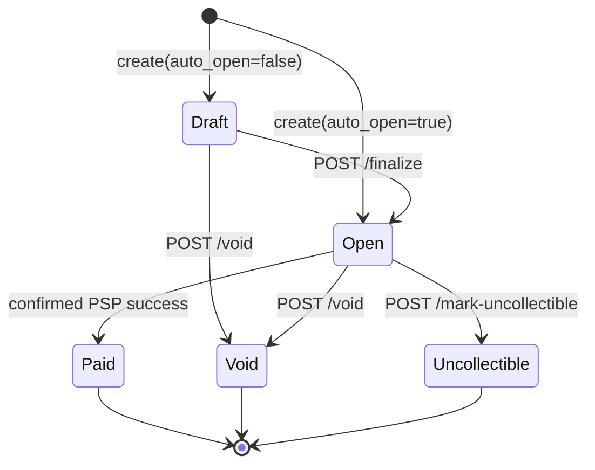

# Design: Invoice & Payment Service

## 1. Data model

This is a small multi-tenant billing core. Every API-key-authenticated request resolves to one `business`; all reads and writes are scoped by that business ID.

| Table | Purpose | Key indexes / constraints |
|---|---|---|
| `businesses` | API-key owner; plaintext keys are never stored. | UUID PK; unique key hash. |
| `customers` | Customer belonging to one business. | `(business_id, email)` index. |
| `invoices` | Customer, USD total in integer cents, due date, lifecycle state. | `(business_id, status)` and customer indexes; database checks enforce USD, valid state, non-negative total. |
| `invoice_line_items` | Immutable server-calculated amounts. | Invoice index; positive quantity and non-negative amounts. |
| `payment_attempts` | Payment audit trail, PSP reference, and outcome. | Invoice index; `pending`, `unknown`, `succeeded`, `failed` states. No submitted bearer token is stored. |
| `idempotency_records` | Operation claim, request hash, attempt reference, cached terminal response. | Unique `(business_id, request_path, idempotency_key)`. |
| `webhook_events` / `webhook_deliveries` | Transactional outbox event and per-endpoint delivery state. | Event business/time and delivery `(status, next_retry_at)` indexes. |

UUIDv4 is appropriate at this scale. At 100x I would use time-ordered UUIDv7 for high-write tables, paginate lists, partition history, and move outbox consumption to dedicated workers only after database polling becomes a bottleneck.

## 2. Invoice state machine

`paid`, `void`, and `uncollectible` are terminal. Declines, explicit PSP failures, and ambiguous PSP errors leave the invoice `open`. Route-specific validation plus a row lock rejects invalid transitions with `422 invalid_state_transition`. Line items are immutable after creation.

## 3. Payment correctness and failure modes

`POST /v1/invoices/{id}/pay` requires `Idempotency-Key`. Its SHA-256 raw-body hash is bound to the business and exact operation path. An atomic `INSERT ... ON CONFLICT DO NOTHING RETURNING` claims a new key; a matching completed key returns the stored response, a mismatched body is `409`, and an in-progress key is `409`. A 30-second claim lease permits recovery after a process crash.

The payment transaction locks its invoice with `SELECT ... FOR UPDATE`. This is safer here than an in-memory lock (unsafe across replicas) or optimistic locking (which may contact the PSP twice before discovering a conflict). Its trade-off is a bounded five-second downstream call holding an invoice lock; production should monitor contention and apply explicit pool/lock timeouts.

**a. Two simultaneous payments.** The first request locks the open invoice and calls the PSP. A different key waits and, after success, sees `paid` and returns `422` without calling the PSP. The same key cannot call the PSP concurrently. The concurrency test asserts one successful attempt and one PSP call.

**b. `tok_timeout`.** A client timeout is an *unknown*, not a decline: the upstream may still finish. The invoice stays `open`; the attempt and idempotency record become `unknown`; the API returns `504`. The caller must retry only with the same key, and another key is rejected until resolution. The mock reserves the key before its simulated charge and retains the successful outcome, so a retry cannot start a second charge.

**c. PSP success then service crash.** The caller key is sent downstream. The in-progress claim becomes reclaimable after 30 seconds; retrying the same operation sends the same PSP key. A real PSP must durably deduplicate it and return the original result. The mock implements the same contract for this exercise.

**d. Same key, different body.** The hash mismatch returns `409`; no attempt or PSP call occurs. The key can be used on another invoice because the unique scope includes the request path, preventing invoice A's response from being replayed for invoice B.

**e. Pay an already-paid invoice.** A matching cached replay returns the prior result. A new operation locks the row, returns `422`, and never contacts the PSP.

## 4. Webhooks

Creation, successful payment, and decline insert their event and all current endpoint deliveries in the same transaction as the domain change. API handlers never wait for recipient HTTP calls. Workers claim due rows with `FOR UPDATE SKIP LOCKED`, set a 30-second lease, and recover expired leases after a crash. Delivery is deliberately **at-least-once**; `X-Webhook-Event-Id` supports receiver deduplication.

The signed content is `timestamp.payload`, HMAC-SHA256, sent as `X-Webhook-Signature: t=<unix>,v1=<hex>`. Receivers should reject timestamps beyond a five-minute window before signature verification. Non-2xx responses retry after 30 seconds, 2 minutes, 10 minutes, 1 hour, and 6 hours (six attempts total); exhausted deliveries become `failed`. Businesses reconcile through `GET /v1/webhooks/events`.

Endpoints must be absolute HTTPS URLs without credentials and resolve only to public addresses; redirects are disabled. Production also needs egress policy to defend against DNS rebinding.

## 5. API keys

Production keys use 256 bits of OS randomness, are shown once, sent as Bearer credentials over TLS, and stored only as a prefix plus SHA-256 hash. The committed `dp_live_testkey123` is a local demo credential, never a production secret. Rotation supports a brief overlap; revocation removes the hash. A leaked key is limited to its own business by tenant-scoped queries.

## 6. Deliberately cut

- Refunds, credit notes, and partial payments need a separate ledger and reversal rules.
- Subscriptions, proration, tax, FX, and dunning distract from the core payment exercise.
- OAuth and a frontend are outside the required API surface.
- A dedicated broker is unnecessary while the PostgreSQL outbox avoids a dual-write problem.

## 7. Production gaps

First additions: OpenTelemetry metrics/tracing, distributed rate limiting, and a durable payment-intent plus PSP reconciliation flow for ambiguous outcomes. That model makes the PSP operation a first-class resource and consumes PSP webhooks or polling rather than relying on a client retry. It is deliberately not built here: the take-home PSP has no reconciliation API, and building a scheduler/webhook consumer would add infrastructure beyond the required payment path. Audit logs, secret management, dependency-aware readiness, key-rotation endpoints, and a production egress firewall follow.
